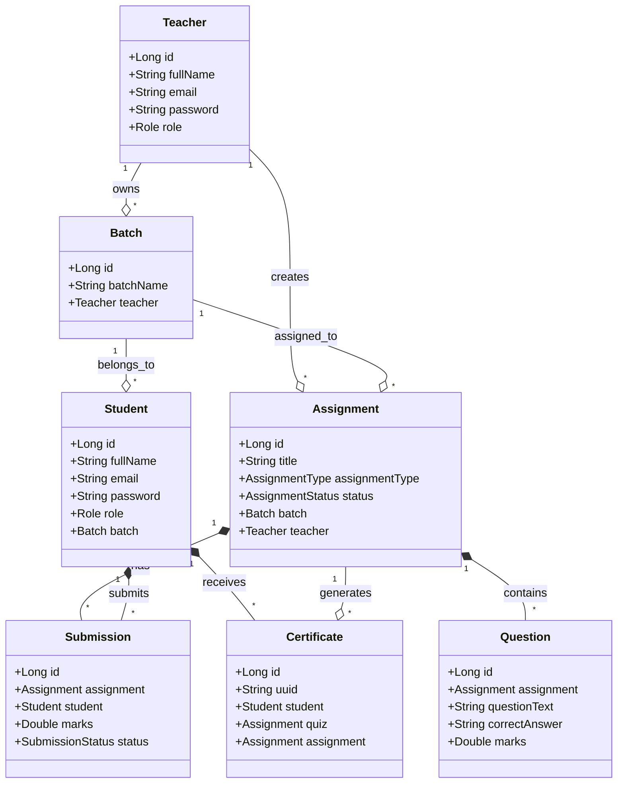

# Assignment Management System (AMS) - Backend Documentation

This repository contains the backend codebase of the **Assignment Management System (AMS)**, built using Spring Boot. This document serves as a complete technical guide for developers onboarding onto the project.

---

## 1. Project Overview

The **Assignment Management System (AMS)** is a web-based educational portal designed to facilitate assignment and quiz management. It provides separate dashboards and workflows for **Teachers** and **Students** to manage batches, subjects, quizzes, assignments, automated grading, and PDF certificate generation.

### Key Capabilities
* **Drafting and Publishing Quizzes & Assignments**: Teachers can create quizzes/assignments as drafts and later assign them to one or more batches.
* **Automated Grading**: Quizzes are auto-evaluated on submission.
* **PDF Certificate Generation**: Students who pass a quiz or assignment can generate and download secure, verifiable PDF certificates featuring verifiable QR codes.
* **Excel Import/Export**: Teachers can import quiz questions from Excel files (`.xlsx`) and export student performance sheets.
* **Performance Caching**: Redis is used to cache real-time student submission metrics and completion percentages.
* **File Uploads**: Cloudinary is integrated for storing class resources and student file submissions.

### Tech Stack
* **Framework**: Spring Boot 3.x (Java 17)
* **Security**: Spring Security + JSON Web Token (JWT) stored in secure, `HttpOnly` cookies.
* **Database**: PostgreSQL (JPA/Hibernate ORM)
* **Caching**: Redis (Spring Data Redis)
* **Object Mapping**: MapStruct
* **File Storage**: Cloudinary
* **PDF Engine**: OpenPDF (for certificate styling and generation)
* **Build System**: Maven

### Architecture
The project follows a standard **layered (N-tier) architecture**:

```
[ Client / UI ]
       │  (HTTP Request with JWT Cookie)
       ▼
[ Security Filter Chain / Controllers ] (Request mapping, validation, role restriction)
       │  (DTOs)
       ▼
[ Service Layer ] (Core business logic, transaction boundaries, cache eviction)
       │  (Entities)
       ▼
[ Repository Layer ] (Database access, Spring Data JPA, Hibernate)
       │
       ▼
[ PostgreSQL / Redis / Cloudinary ]
```

---

## 2. Complete Folder Structure

Below is the directory structure under `src/main/java/com/assignment`:

```text
src/main/java/com/assignment/
 ├── AssignmentManagementApplication.java
 ├── config/
 │    ├── CloudinaryConfig.java
 │    ├── DataInitializer.java
 │    ├── JwtAuthenticationFilter.java
 │    ├── JwtService.java
 │    ├── RedisConfig.java
 │    └── SecurityConfig.java
 ├── controller/
 │    ├── AssignmentController.java
 │    ├── AuthController.java
 │    ├── BatchController.java
 │    ├── CertificateController.java
 │    ├── DashboardController.java
 │    ├── StudentController.java
 │    ├── SubjectController.java
 │    └── SubmissionController.java
 ├── dto/
 │    ├── QuizImportDTO.java
 │    ├── request/
 │    │    ├── AddStudentRequest.java
 │    │    ├── AssignmentRequest.java
 │    │    ├── BatchRequest.java
 │    │    ├── LoginRequest.java
 │    │    ├── QuestionRequest.java
 │    │    ├── StudentRegisterRequest.java
 │    │    ├── StudentSubmitRequest.java
 │    │    ├── SubmissionReviewRequest.java
 │    │    └── TeacherRegisterRequest.java
 │    └── response/
 │         ├── ApiResponse.java
 │         ├── AssignmentResponse.java
 │         ├── AssignmentStatusResponse.java
 │         ├── AuthResponse.java
 │         ├── BatchResponse.java
 │         ├── CertificateResponse.java
 │         ├── QuestionResponse.java
 │         ├── StudentDashboardResponse.java
 │         ├── StudentResponse.java
 │         ├── SubjectResponse.java
 │         ├── SubmissionResponse.java
 │         ├── TeacherDashboardResponse.java
 │         └── TeacherResponse.java
 ├── entity/
 │    ├── Assignment.java
 │    ├── Batch.java
 │    ├── Certificate.java
 │    ├── Question.java
 │    ├── Student.java
 │    ├── Subject.java
 │    ├── Submission.java
 │    └── Teacher.java
 ├── enums/
 │    ├── AssignmentStatus.java
 │    ├── AssignmentType.java
 │    ├── Role.java
 │    └── SubmissionStatus.java
 ├── exception/
 │    ├── BadRequestException.java
 │    ├── CustomException.java
 │    ├── GlobalExceptionHandler.java
 │    ├── ResourceNotFoundException.java
 │    └── UnauthorizedException.java
 ├── mapper/
 │    ├── AssignmentMapper.java
 │    ├── BatchMapper.java
 │    ├── CertificateMapper.java
 │    ├── QuestionMapper.java
 │    ├── SubjectMapper.java
 │    ├── SubmissionMapper.java
 │    └── UserMapper.java
 ├── repository/
 │    ├── AssignmentRepository.java
 │    ├── BatchRepository.java
 │    ├── CertificateRepository.java
 │    ├── QuestionRepository.java
 │    ├── StudentRepository.java
 │    ├── SubjectRepository.java
 │    ├── SubmissionRepository.java
 │    └── TeacherRepository.java
 ├── security/
 │    └── CustomUserDetailsService.java
 └── util/
      ├── ExcelExportUtil.java
      ├── ExcelValidator.java
      └── QrCodeUtil.java
```

### Package Descriptions
* **`config/`**: Contains security and database setup, including CORS, CORS filters, JWT generation policies, Redis caching templates, and seed-data initialization.
* **`controller/`**: Orchestrates external HTTP requests, deserializes payloads, enforces JSR-380 input validations, and maps responses.
* **`dto/`**: Request and Response data transfer containers, separating business models from persistent entities.
* **`entity/`**: Persistent relational mapping objects managed by JPA.
* **`enums/`**: Fixed domain enumerations representing roles, statuses, and types.
* **`exception/`**: Custom runtime exceptions and a controller-advise handler (`GlobalExceptionHandler.java`) to standardize JSON error responses.
* **`mapper/`**: MapStruct-driven conversion interfaces mapping Entities to DTOs.
* **`repository/`**: Layer of interfaces extending `JpaRepository` representing CRUD operations.
* **`security/`**: Houses Spring Security's `UserDetailsService` to resolve principals from Hibernate.
* **`service/`**: Declarative business interfaces and their concrete implementations (`impl/`).
* **`util/`**: Helpers for processing byte streams, parsing Excel cells, QR Code matrices, and PDF alignments.

---

## 3. Complete API Documentation

### POST /api/auth/register/teacher
* **Purpose**: Registers a new teacher account.
* **Controller**: `AuthController.java` (`registerTeacher`)
* **Service**: `AuthService.java` (`registerTeacher`)
* **Entities involved**: `Teacher`
* **DTOs**: `TeacherRegisterRequest`, `AuthResponse`
* **Validations**: Email must be unique, passwords must match criteria, and role is defaulted to `TEACHER`.
* **Database Operations**: Inserts a new record into `teachers` table.
* **Response Example**:
  ```json
  {
    "success": true,
    "message": "Teacher registered successfully",
    "data": {
      "token": "eyJhbGciOiJIUzI1NiJ9...",
      "role": "TEACHER"
    }
  }
  ```

### POST /api/auth/register/student
* **Purpose**: Registers a new student account.
* **Controller**: `AuthController.java` (`registerStudent`)
* **Service**: `AuthService.java` (`registerStudent`)
* **Entities involved**: `Student`, `Batch`
* **DTOs**: `StudentRegisterRequest`, `AuthResponse`
* **Validations**: Email must be unique. `batchId` is validated to ensure it exists.
* **Database Operations**: Inserts a new record into `students` table.
* **Response Example**:
  ```json
  {
    "success": true,
    "message": "Student registered successfully",
    "data": {
      "token": "eyJhbGciOiJIUzI1NiJ9...",
      "role": "STUDENT"
    }
  }
  ```

### POST /api/auth/login
* **Purpose**: Authenticates a user and sets an HttpOnly cookie containing the JWT.
* **Controller**: `AuthController.java` (`login`)
* **Service**: `AuthService.java` (`login`)
* **DTOs**: `LoginRequest`, `AuthResponse`
* **Response**: Sets cookie `JWT_TOKEN` and returns JSON auth payload.

### POST /api/teacher/assignments
* **Purpose**: Creates a new assignment or quiz.
* **Controller**: `AssignmentController.java` (`createAssignment`)
* **Service**: `AssignmentService.java` (`createAssignment`)
* **Entities**: `Assignment`, `Question`
* **DTOs**: `AssignmentRequest` (as multipart form data), `AssignmentResponse`
* **Database Operations**: Saves assignment to `assignments` and optionally inserts to `questions` table if the type is `QUIZ`.

### POST /api/teacher/assignments/{assignmentId}/assign
* **Purpose**: Publishes/assigns a draft quiz or assignment to one or more batches.
* **Controller**: `AssignmentController.java` (`assignBatch`)
* **Service**: `AssignmentService.java` (`assignBatch`)
* **Entities**: `Assignment`, `Batch`, `Question`
* **Business Logic**: Reuses the draft assignment if it has zero submissions. If the assignment already has submissions, it clones the assignment and questions to guarantee a fresh submission history for the target batch.
* **Database Operations**: Updates existing assignment or inserts new cloned assignment and cloned questions.

### POST /api/student/assignments/{assignmentId}/submit
* **Purpose**: Submits quiz answers or uploads an assignment file.
* **Controller**: `SubmissionController.java` (`submitAssignment`)
* **Service**: `SubmissionService.java` (`submitAssignment`)
* **Entities**: `Submission`, `Assignment`, `Student`
* **DTOs**: `StudentSubmitRequest`, `SubmissionResponse`
* **Business Logic**: For quizzes, parsing the JSON options, grading answers against key choices, scoring immediately, and saving the submission with status `REVIEWED`. Then, triggers certificate generation if passing marks are met.
* **Database Operations**: Inserts or updates a record in `submissions` table.

---

## 4. Complete API Flow

The request-response path for endpoints conforms to the following flow:

```
[Client] ──(HTTP Request + Cookie)──► [JwtAuthenticationFilter] ──► [Controller]
                                                                        │
[Client] ◄──(HTTP Response JSON)◄── [Controller] ◄──(DTO Map)◄── [Service Impl]
                                                                        │
[Repository Layer] ◄──(Spring Data JPA)◄── [JPA Entity] ◄───────────────┘
         │
         ▼
[PostgreSQL Database]
```

1. **Client**: Transmits HTTP requests (e.g. submitting a quiz answer payload to `/api/student/assignments/5/submit`).
2. **Filter**: `JwtAuthenticationFilter` intercepts the request, reads `JWT_TOKEN` from cookies, extracts the username, verifies the roles, and registers the authentication principal in Spring Security's `SecurityContext`.
3. **Controller**: The mapping resolves to `SubmissionController.submitAssignment()`. Request parameters are validated using `@Valid`.
4. **Service**: Delegation is made to `SubmissionServiceImpl.submitAssignment()`. Transaction context is opened.
5. **Repository**: Service retrieves `Assignment` and `Student` records via standard JPA hooks: `assignmentRepository.findById()` and `studentRepository.findById()`.
6. **Database**: Hibernate executes SELECT/INSERT/UPDATE statements.
7. **Mapper**: `SubmissionMapper` maps the saved `Submission` entity into a `SubmissionResponse` DTO.
8. **Controller/Client**: The controller wraps the DTO inside `ApiResponse` and serializes it to JSON, returning a `200 OK` response.

---

## 5. Internal Method Flow

### publishQuiz / assignBatch Workflow
The service method `assignBatch()` in `AssignmentServiceImpl.java` publishes drafts or distributes existing assignments:

```
assignBatch()
  │
  ├──► Validate Teacher ownership of Assignment template
  ├──► Retrieve Batch entities from database
  │
  ├──► Check if template has existing Submissions
  │     ├──► If NO Submissions:
  │     │     └──► Directly set first Batch, mark status ACTIVE, save Assignment
  │     └──► If HAS Submissions:
  │           └──► Keep original template untouched, flag first Batch for cloning
  │
  ├──► Loop batches to clone Assignments
  │     ├──► Clone Assignment attributes (title, description, marks, dates, etc.)
  │     ├──► Save Cloned Assignment
  │     ├──► Clone associated Questions pointing to new Cloned Assignment
  │     └──► Save Cloned Questions
  │
  ├──► Rebuild Redis Cache completion metrics for new assignments
  └──► Return populated AssignmentResponse DTO list
```

---

## 6. Authentication Flow

AMS uses stateful JWT authentication stored inside secure cookies.

```
Login Request (JSON) ──► AuthenticationManager ──► Load UserDetails ──► Generate JWT Token
                                                                             │
Client ◄── HttpOnly Cookie (JWT_TOKEN) ◄── Set Response Header ◄─────────────┘
```

1. **JWT Generation**:
   Upon logging in successfully, `JwtService.generateToken()` constructs a token incorporating claims, username, and role, signing it using a HMAC-SHA256 signature from `app.jwt.secret`.
2. **JWT Storage**:
   The token is appended to the response headers using an `HttpOnly`, `Secure` (in production), and `Path=/` Cookie under the name `JWT_TOKEN` to shield it from XSS token theft.
3. **Authentication Verification**:
   For subsequent API calls, `JwtAuthenticationFilter` intercepts incoming requests, reads the cookie, verifies the claims, retrieves the user profile from `CustomUserDetailsService`, and loads an `UsernamePasswordAuthenticationToken` principal in the Spring security context.
4. **Endpoint Access Control**:
   Paths are protected in `SecurityConfig.java` using role checks:
   * `/api/teacher/**` paths require the `TEACHER` role.
   * `/api/student/**` paths require the `STUDENT` role.
   * Authentication endpoints under `/api/auth/**` are open to anonymous access.

---

## 7. Database Flow

Below is the entity schema and entity associations mapping:



### Cascades and Fetch Types
* **`Assignment` ──► `Question`**: `OneToMany` with `CascadeType.ALL` and `orphanRemoval = true`. Deleting an assignment cascades deletes to all of its questions.
* **`Assignment` ──► `Submission`**: `OneToMany` with `CascadeType.ALL` and `orphanRemoval = true`.
* **Associations Fetch Strategy**: Relationships (e.g. `@ManyToOne` referencing `Batch` or `Teacher` in entities) are flagged `FetchType.LAZY` to optimize query execution and prevent N+1 queries.

---

## 8. Module-wise Documentation

### Redis Module
Configured in `RedisConfig.java` and implemented in `RedisServiceImpl.java`.
* **Purpose**: Caching student performance analytics.
* **Workflow**: When students submit quizzes or when teachers edit assignments, the system recalculates batch performance stats (submission counts, pending student lists, batch completion ratios) and writes them to Redis cache under serialized hashes via `saveAssignmentStatus()`.

### Certificate Module
Implemented in `CertificateServiceImpl.java`.
* **Purpose**: Formats and builds PDF certificates.
* **Workflow**: On passing score validation, it renders a custom certificate template containing:
  - Student name, quiz title, grade.
  - A secure cryptographic token and corresponding QR Code containing the URL pointing to `/api/certificates/verify/{token}`.
  - Verification tokens are mapped using SHA-256 hashed UUID strings.

### Excel Import Module
Configured in `ExcelImportServiceImpl.java` and validated in `ExcelValidator.java`.
* **Purpose**: Direct parsing of student lists or quiz question rosters from Excel documents.
* **Workflow**: Uses Apache POI cell row iterations, executing cell validator heuristics (`validateFile()`, `validateQuestions()`) before returning rows as imports.

---

## 9. API Dependency Graph

API operations conform to strict dependency pipelines:

```
Register Account (Teacher / Student)
        │
        ▼
Create Batch (Teacher)
        │
        ▼
Add Student to Batch (Teacher)
        │
        ▼
Draft Assignment/Quiz (Teacher)
        │
        ▼
Assign/Publish Quiz to Batch (Teacher)
        │
        └───► Student views Active Quizzes
                     │
                     ▼
              Submit Quiz Answers (Student)
                     │
                     ├──────────────┐ (Pass Marks Met)
                     ▼              ▼
              Auto Grading    Generate Certificate
                     │
                     ▼
              Review Submission (Teacher)
```

---

## 10. Complete Request Lifecycle

```
[ Client Request ]
       │
       ▼
[ JwtAuthenticationFilter ] (Decodes Cookie JWT, sets Principal)
       │
       ▼
[ DispatcherServlet ] (Resolves controller mapping)
       │
       ▼
[ GlobalExceptionHandler ] (Intercepts MVC failures)
       │
       ▼
[ Controller ] (Deserializes JSON, calls validations)
       │
       ▼
[ Service (Proxy) ] (Begins Transaction context)
       │
       ▼
[ Repository / JPA ] (Saves Entity changes)
       │
       ▼
[ MapStruct Mapper ] (Converts Entity into DTO)
       │
       ▼
[ DispatcherServlet ] (Serializes JSON payload)
       │
       ▼
[ Client Response ]
```

---

## 11. Sequence Diagrams

### Quiz Creation and Batch Assignment
```
Teacher              AssignmentController       AssignmentService        Repository          Database
   │                          │                          │                    │                  │
   │──► createAssignment() ──►│                          │                    │                  │
   │    (Draft request)       │──► createAssignment() ──►│                    │                  │
   │                          │                          │──► save() ────────►│                  │
   │                          │                          │    (Draft)         │──► INSERT ──────►│
   │                          │    AssignmentResponse    │◄── Saved Entity ───│                  │
   │◄── Saved draft Response ◄│◄─────────────────────────│                    │                  │
   │                          │                          │                    │                  │
   │──► assignBatch() ───────►│                          │                    │                  │
   │    (Publish to Batch)    │──► assignBatch() ───────►│                    │                  │
   │                          │                          │──► clone/save() ──►│                  │
   │                          │                          │    (Published)     │──► INSERT/UPDATE►│
   │◄── Published Response ◄──│◄─────────────────────────│◄───────────────────│                  │
```

---

## 12. Error Handling

Centralized exception mapping is configured inside `GlobalExceptionHandler.java`:

* **`ResourceNotFoundException`**: Handled to return `404 Not Found`.
* **`BadRequestException`**: Returns `400 Bad Request`.
* **`UnauthorizedException`**: Returns `401 Unauthorized`.
* **`MethodArgumentNotValidException`**: Triggered by Spring Validation validations (`@NotBlank`, `@NotNull`, `@Email`), returning detailed error maps detailing invalid fields.
* **`Exception` (Generic fallback)**: Catches unexpected runtime failures, returning a standardized `500 Internal Server Error` message.

---

## 13. Configuration Classes

* **`SecurityConfig.java`**: Hooks Spring Security. Establishes context authentication filters, maps CORS origins, and defines endpoints permission matrices.
* **`RedisConfig.java`**: Instantiates the connection factory (Jedis/Lettuce client) and sets up key/value serialization rules for the Redis template.
* **`CloudinaryConfig.java`**: Sets up key mappings connecting the Cloudinary media service.
* **`DataInitializer.java`**: Automatically registers default roles (e.g. system admins, batch entries) upon server initialization.

---

## 14. Environment Variables

To run the application, set these environment variables:

| Variable | Description | Default / Example |
| -------- | ----------- | ----------------- |
| `DATABASE_URL` | PostgreSQL Connection URI | `jdbc:postgresql://localhost:5432/assignment_db` |
| `DATABASE_USERNAME` | DB login username | `postgres` |
| `DATABASE_PASSWORD` | DB login credentials | `yourpassword` |
| `REDIS_HOST` | Redis Server IP | `localhost` |
| `REDIS_PORT` | Redis TCP Port | `6379` |
| `REDIS_PASSWORD` | Redis connection password | `redispassword` |
| `REDIS_SSL_ENABLED` | SSL connection flag (for Cloud Redis Providers) | `false` |
| `CLOUDINARY_CLOUD_NAME` | Cloudinary Name | `cloudname` |
| `CLOUDINARY_API_KEY` | Cloudinary Key | `api_key` |
| `CLOUDINARY_API_SECRET` | Cloudinary Secret | `api_secret` |

---

## 15. How to Run the Project

### Heuristics & Prerequisites
Ensure you have the following installed:
* Java Development Kit (JDK) 17+
* Apache Maven
* PostgreSQL Database Engine
* Redis Server

### Steps to Run
1. **Database Setup**:
   Create a database in PostgreSQL:
   ```sql
   CREATE DATABASE assignment_db;
   ```
2. **Setup Environment**:
   Configure the environment variables listed in Section 14 or modify `src/main/resources/application.properties` directly.
3. **Compile & Package**:
   Run the maven build command to package the JAR:
   ```bash
   mvn clean package
   ```
4. **Execute Application**:
   Run the Spring Boot application:
   ```bash
   mvn spring-boot:run
   ```

---

## 16. API Index

| Method | Endpoint | Controller | Service Method | Description | Role Required |
| ------ | -------- | ---------- | -------------- | ----------- | ------------- |
| `POST` | `/api/auth/register/teacher` | `AuthController` | `registerTeacher` | Register teacher | Public |
| `POST` | `/api/auth/register/student` | `AuthController` | `registerStudent` | Register student | Public |
| `POST` | `/api/auth/login` | `AuthController` | `login` | Login and set JWT Cookie | Public |
| `POST` | `/api/auth/logout` | `AuthController` | `logout` | Logout and clear cookie | Public |
| `GET` | `/api/auth/batches` | `AuthController` | `getAllBatches` | List all batches for registration | Public |
| `PUT` | `/api/auth/profile/update` | `AuthController` | `updateProfile` | Update account profile details | Authenticated |
| `POST` | `/api/teacher/batches` | `BatchController` | `createBatch` | Create new student batch | `TEACHER` |
| `GET` | `/api/teacher/batches` | `BatchController` | `getTeacherBatches` | List batches managed by teacher | `TEACHER` |
| `GET` | `/api/teacher/batches/{id}` | `BatchController` | `getBatchById` | View detailed batch profile | `TEACHER` |
| `PUT` | `/api/teacher/batches/{id}` | `BatchController` | `updateBatch` | Update batch parameters | `TEACHER` |
| `DELETE`| `/api/teacher/batches/{id}` | `BatchController` | `deleteBatch` | Remove batch entity | `TEACHER` |
| `POST` | `/api/teacher/students` | `StudentController` | `addStudentToBatch` | Link student to teacher's batch | `TEACHER` |
| `GET` | `/api/teacher/batches/{id}/students` | `StudentController` | `getStudentsInBatch` | List student records in batch | `TEACHER` |
| `DELETE`| `/api/teacher/students/{id}` | `StudentController` | `removeStudentFromBatch`| Unlink student from batch | `TEACHER` |
| `POST` | `/api/teacher/assignments` | `AssignmentController` | `createAssignment` | Create new assignment / quiz template | `TEACHER` |
| `GET` | `/api/teacher/assignments` | `AssignmentController` | `getTeacherAssignments` | List assignments owned by teacher | `TEACHER` |
| `GET` | `/api/teacher/assignments/{id}` | `AssignmentController` | `getAssignmentById` | View assignment details | `TEACHER` |
| `PUT` | `/api/teacher/assignments/{id}` | `AssignmentController` | `updateAssignment` | Edit assignment / quiz details | `TEACHER` |
| `DELETE`| `/api/teacher/assignments/{id}` | `AssignmentController` | `deleteAssignment` | Delete assignment instance | `TEACHER` |
| `POST` | `/api/teacher/assignments/{id}/assign` | `AssignmentController` | `assignBatch` | Publish/assign quiz to batches | `TEACHER` |
| `POST` | `/api/teacher/assignments/{id}/unassign` | `AssignmentController`| `unassignBatch` | Unassign batch from quiz | `TEACHER` |
| `GET` | `/api/teacher/assignments/{id}/results/download` | `AssignmentController` | `exportAssignmentResults`| Export performance sheet as Excel | `TEACHER` |
| `GET` | `/api/student/assignments` | `AssignmentController` | `getStudentAssignments` | List active assignments for student | `STUDENT` |
| `GET` | `/api/student/assignments/{id}` | `AssignmentController` | `getStudentAssignmentDetails`| View assignment detail (Student) | `STUDENT` |
| `POST` | `/api/student/assignments/{id}/submit` | `SubmissionController` | `submitAssignment` | Submit quiz/assignment responses | `STUDENT` |
| `GET` | `/api/student/submissions` | `SubmissionController` | `getStudentSubmissions` | View submission history (Student) | `STUDENT` |
| `GET` | `/api/student/submissions/{id}` | `SubmissionController` | `getSubmissionById` | View detailed submission outcome | `STUDENT` |
| `GET` | `/api/teacher/assignments/{id}/submitted` | `SubmissionController` | `getSubmissionsForAssignment`| List submissions for assignment | `TEACHER` |
| `GET` | `/api/teacher/assignments/{id}/pending` | `SubmissionController` | `getPendingSubmissionsForAssignment`| List pending review submissions | `TEACHER` |
| `PUT` | `/api/teacher/submissions/{id}/review` | `SubmissionController` | `reviewSubmission` | Grade and write review feedback | `TEACHER` |
| `GET` | `/api/student/certificates` | `CertificateController` | `getStudentCertificates` | List certificates earned by student | `STUDENT` |
| `GET` | `/api/student/certificates/{id}` | `CertificateController` | `getCertificateById` | Get certificate profile metadata | `STUDENT` |
| `GET` | `/api/student/certificates/{id}/download` | `CertificateController` | `downloadCertificate` | Stream PDF certificate | `STUDENT` |
| `GET` | `/api/certificates/verify/{token}` | `CertificateController` | `verifyCertificate` | Public verification endpoint | Public |

---

## 17. Class Cross-References

For codebase navigation, here are references to core files and classes:

* **Controllers**:
  - [`AuthController.java`](/AMS/Backend/src/main/java/com/assignment/controller/AuthController.java)
  - [`BatchController.java`](/AMS/Backend/src/main/java/com/assignment/controller/BatchController.java)
  - [`StudentController.java`](/AMS/Backend/src/main/java/com/assignment/controller/StudentController.java)
  - [`AssignmentController.java`](/AMS/Backend/src/main/java/com/assignment/controller/AssignmentController.java)
  - [`SubmissionController.java`](/AMS/Backend/src/main/java/com/assignment/controller/SubmissionController.java)
  - [`CertificateController.java`](/AMS/Backend/src/main/java/com/assignment/controller/CertificateController.java)
* **Services**:
  - [`AuthService.java`](/AMS/Backend/src/main/java/com/assignment/service/AuthService.java) / [`AuthServiceImpl.java`](/AMS/Backend/src/main/java/com/assignment/service/impl/AuthServiceImpl.java)
  - [`BatchService.java`](/AMS/Backend/src/main/java/com/assignment/service/BatchService.java) / [`BatchServiceImpl.java`](/AMS/Backend/src/main/java/com/assignment/service/impl/BatchServiceImpl.java)
  - [`StudentService.java`](/AMS/Backend/src/main/java/com/assignment/service/StudentService.java) / [`StudentServiceImpl.java`](/AMS/Backend/src/main/java/com/assignment/service/impl/StudentServiceImpl.java)
  - [`AssignmentService.java`](/AMS/Backend/src/main/java/com/assignment/service/AssignmentService.java) / [`AssignmentServiceImpl.java`](/AMS/Backend/src/main/java/com/assignment/service/impl/AssignmentServiceImpl.java)
  - [`SubmissionService.java`](/AMS/Backend/src/main/java/com/assignment/service/SubmissionService.java) / [`SubmissionServiceImpl.java`](/AMS/Backend/src/main/java/com/assignment/service/impl/SubmissionServiceImpl.java)
  - [`CertificateService.java`](/AMS/Backend/src/main/java/com/assignment/service/CertificateService.java) / [`CertificateServiceImpl.java`](/AMS/Backend/src/main/java/com/assignment/service/impl/CertificateServiceImpl.java)
  - [`RedisService.java`](/AMS/Backend/src/main/java/com/assignment/service/RedisService.java) / [`RedisServiceImpl.java`](/AMS/Backend/src/main/java/com/assignment/service/impl/RedisServiceImpl.java)
* **Entities**:
  - [`Teacher.java`](/AMS/Backend/src/main/java/com/assignment/entity/Teacher.java)
  - [`Student.java`](/AMS/Backend/src/main/java/com/assignment/entity/Student.java)
  - [`Batch.java`](/AMS/Backend/src/main/java/com/assignment/entity/Batch.java)
  - [`Assignment.java`](/AMS/Backend/src/main/java/com/assignment/entity/Assignment.java)
  - [`Question.java`](/AMS/Backend/src/main/java/com/assignment/entity/Question.java)
  - [`Submission.java`](/AMS/Backend/src/main/java/com/assignment/entity/Submission.java)
  - [`Certificate.java`](/AMS/Backend/src/main/java/com/assignment/entity/Certificate.java)
* **Security & Configurations**:
  - [`SecurityConfig.java`](/AMS/Backend/src/main/java/com/assignment/config/SecurityConfig.java)
  - [`JwtAuthenticationFilter.java`](/AMS/Backend/src/main/java/com/assignment/config/JwtAuthenticationFilter.java)
  - [`JwtService.java`](/AMS/Backend/src/main/java/com/assignment/config/JwtService.java)
  - [`RedisConfig.java`](/AMS/Backend/src/main/java/com/assignment/config/RedisConfig.java)
